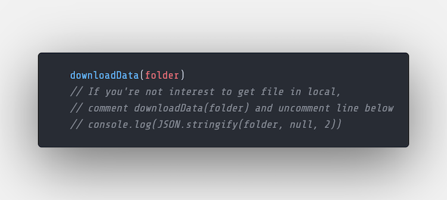
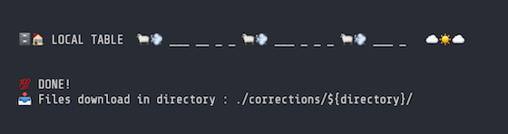

#  :file_cabinet: :house: LOCAL TABLE 

##### Local Table help you download file from airtable to your local computer with command line

<u>**Note :**</u><br>
If you're instrested to fetching files link without download to local.<br>
please follow this information :arrow_heading_down:<br>
​
**find this code** in `localTable.js` and `localSpecific.js`

> ######  :rocket: Local Tabel faster than GUI

<br>

## Getting Started

```
npm install 
npm link 
touch .env 
```

**Write your env with this template**

```js
APIKEY="REPLACE_WITH_AIRTABLE_APIKEY"
```

<br>

## List CLI (Command Line)   

**Local Table** by default download file to your local directory :inbox_tray:

| CLI                                     | Description                                                  |
| --------------------------------------- | ------------------------------------------------------------ |
| lt <base_id> <table_name>               | To get all file from **table in your database**              |
| lt <base_id> <table_name> <buddy_id>    | To get all file by **buddy_id** from **table in your database** |
| lts <base_id> <table_name> <field_name> | To get **specific file** from all submission in table        |

<br>

## Complete :white_check_mark:




